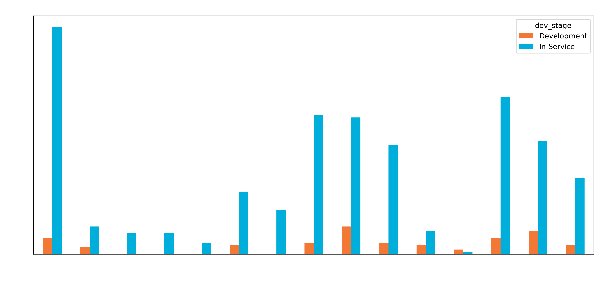
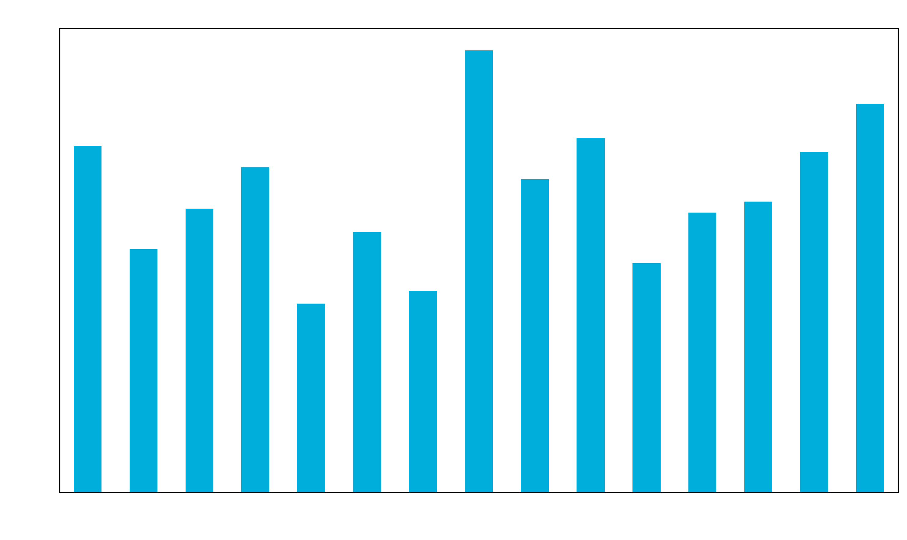
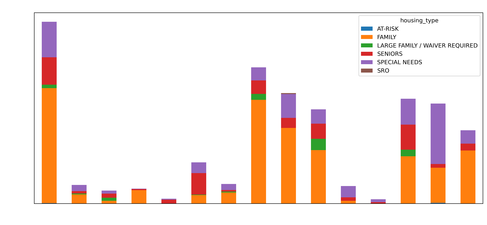
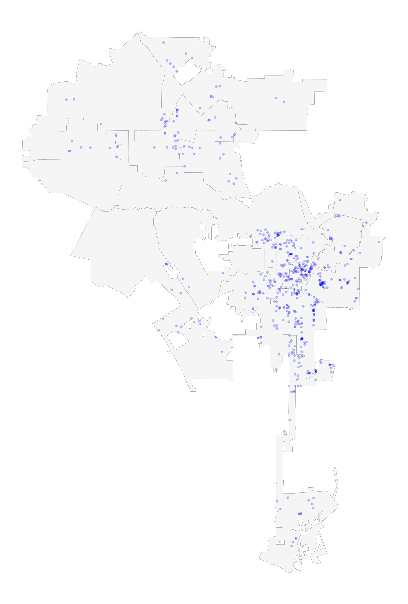
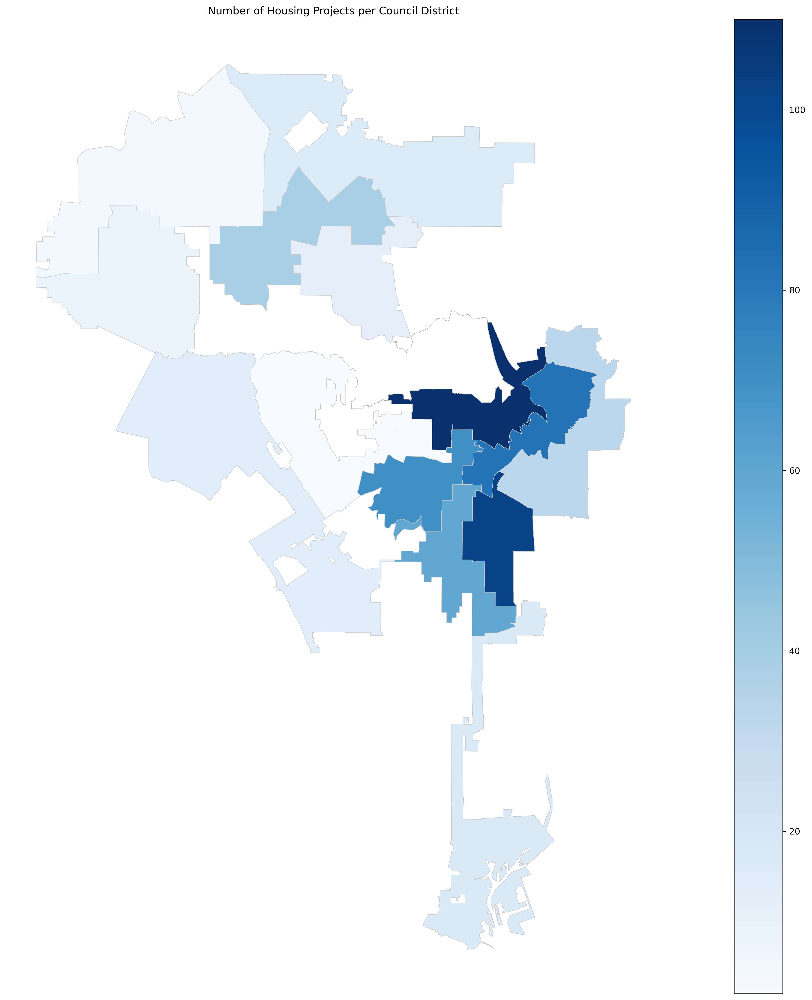

# Evaluating Affordable Housing Sites in the City of Los Angeles
## Introduction
### The City of Los Angeles faces an ongoing housing crisis common up and down the West Coast of the United States and has been working for many years to fund and permit affordable housing in the city. Over 500 affordable housing projects have been built since 2003 totalling more than 45,000 units (Los Angeles Housing Department, 2024). This report seeks to understand how these affordable housing projects have been distributed geographically, and to evaluate their sites through the creation a suitability index that grades locational amenities and hazards in the vicinity of each project. 

## Data Exploration

  
   
  

