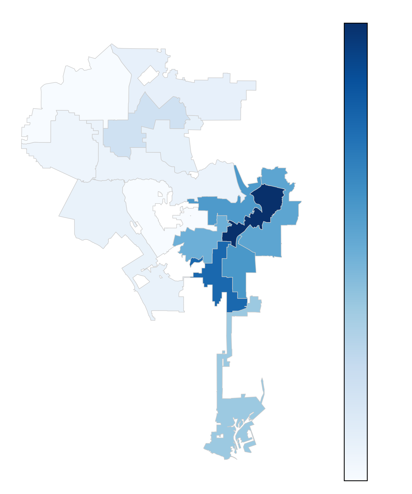

# Evaluating Affordable Housing Sites in the City of Los Angeles

#### Nathan Carlson 
CP255 Spring 2024

## Introduction
#### The City of Los Angeles faces an ongoing housing crisis common up and down the West Coast of the United States and has been working for many years to fund and permit affordable housing in the city. Over 500 affordable housing projects have been built since 2003 totalling more than 45,000 units (Los Angeles Housing Department, 2024). This report seeks to understand how these affordable housing projects have been distributed geographically, and to evaluate their siting through the creation a suitability index that grades locational amenities and hazards in the vicinity of each project. 

## Methodology
The primary dataset for this project was found through the LA City Open Data portal via the Los Angeles Housing Department ("LAHD") and contains information on all "affordable housing" projects in the city since 2003. For the purposes of this project, the term "affordable housing" means any housing project that received LAHD funding from any program, including the Affordable Housing Managed Pipeline, the Supportive Housing Program, the Affordabel Housing Bond Program, and the Proposition HHH Supportive Housing Loan Program. This dataset included coordinate information in addition to information on project status, type, city council district, the dates of project funding and completion, and more. Additional layer data for the suitability index was obtained through the City of Los Angeles (pars, high-injury network, city council districts), Los Angeles Metro (rail station portals), the UC Berkeley Traffic Injury Mapping System (pedestrian fatalitys), the State of California (interstate freeways). The primary program used for this analysis was python to clean, create, and visualize the data, along with ArcGIS for certain map layouts. 

## Data Exploration
Summary Statistics:
* Total completed projects: 505
* Total units constructed citywide to date: 46,867
* Total units in development: 5,209
* Average units/project: 91
* Average construction duration: 1.77 years

   
  

Overall the majority of units have been completed in or near downtown and eastern LA, with a dearth of units observed in western LA and the San Fernando Valley. The total unit distribution roughly follows distribution of projects, but Council Distric 1 has generated the most units by way of denser developments. Council District 1 is located just west of downtown LA, and includes the Pico-Union and Westlake neighborhoods.

## Suitability Analysis
#### To evaluate the suitability of each affordable housing site an index was created using various environmental factors that might impact livability in the immediate area around each project. 500-foot buffers were generated from the geolocated data for each project, and these buffers were used to represent this immediate area. Factors included the following items which were each assigned a positive or negative weight based on their estimated impact on livability:
* Proximity to parks - +1
* Proximity to freeways - -1
* Proximity to High-Injury Network - -1
* Proximity to Metro rail portals - +2
* Presence of fatal pedestrian crashes over the last five years - -2

Buffers for each project were reviewed against the factor layers to see which factors, if any, were present within the 500-foot buffer radius. The overall suitability score for each project would be the sum total value of the weights of all factors present within the 500-foot buffer. 

| Suitability Score | % of Total Projects |
| :---------------: | ------------------: |
| 2                 | 1.8                 |
| 1                 | 0.5                 |
| 0                 | 25.3                |
| -1                | 10.4                |
| -2                | 31.4                | 
| -3                | 26.8                |
| -4                | 3.9                 |

Overall, most sites scored reletively low given that there were more negative factors than positive. Notably, all of the highest scoring projects were clustered together in Council District 8, while lower scoring projects were distributed more evenly across the city. -2 was the most common score, with over 30% of projects falling within this range. Just over 2% of projects obtained a positive score, and around a quarter of all projects were neutrally sited with a score of 0. While there are many other factors that should be examined to obtain a more nuanced understanding of these project sites, but the work conducted here represents a template that can be adjusted moving forward to account for additional factors related to demographics, employment opportunities, environmental justice, and more. 

